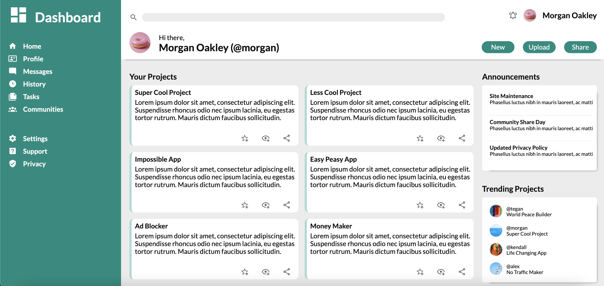

# admin-dashboard

Live Site: [Admin Dashboard](https://kaykaym01.github.io/admin-dashboard/)

[The Odin Project: Admin Dashboard Challenge](https://www.theodinproject.com/lessons/node-path-intermediate-html-and-css-admin-dashboard)

Site Screenshot: 

This project is an imitation Admin Dashboard. Used this to test out HTML/CSS features including:
* CSS Grid
* SVG Elements
* Flexbox
* Advanced CSS Properties

